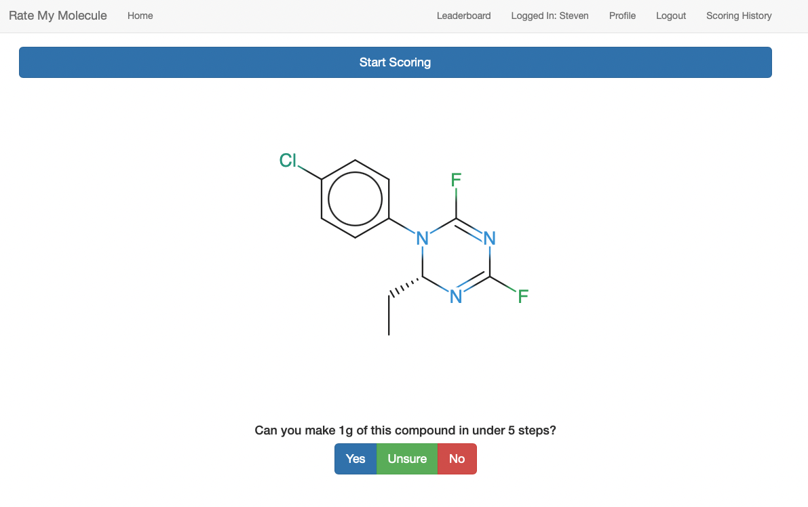

# Rate My Molecule:



Software package for predicting synthetic accesibility of organic molecules. The tools are deployed as a Flask webapp, using PostgreSQL database.

This code was developed by Steven Bennett, while undergoing my PhD in the Jelfs group, [jelfs-group.org](http://www.jelfs-group.org/).

## Installation
### Prerequisites
* Install Docker [OS specific instructions.](https://docs.docker.com/install/).
* Install [docker-compose](https://docs.docker.com/compose/install/#install-compose).

### Building the RateMyMolecule Image

The RMM image can be built using the Dockerfile in the repository ``flask/Dockerfile``. This will build the Flask image to the local machine, however, database-based operations will be unable to be run, if the PostgreSQL container is not running.

### Database Management

The  ``docker-compose.yml`` contains the configuation to deploy the full-stack. This does not require that the RMM Flask image is has been built. To build and run the initial database run
```bash

    docker-compose build database
    docker-compose up -d database
```

This will run the ``database`` Docker image in the background, creating a user, ``example``, and database ``example`` also. It will populate both of them with the SMILES molecules present.

### Running the Full Application


To run the full-stack run
```bash

    docker-compose build
    docker-compose up
```
This will run the three images required to serve the website on ``localhost``, ``database``, ``flask`` and ``nginx``.

If using this for production, specify a username and password for the PostgresSQL database in the `database.conf` folder and remove the default secret key from the Dockerfile.


### Customising the Application


The SMILES strings displayed by default can be customised. These are located in the `init.sql` file in databases, and will automatically add to the database.
Additionally, this website can be used for any type of binary classification problem as the question can be changed.
This can be customised in `flask/main/index.html`.